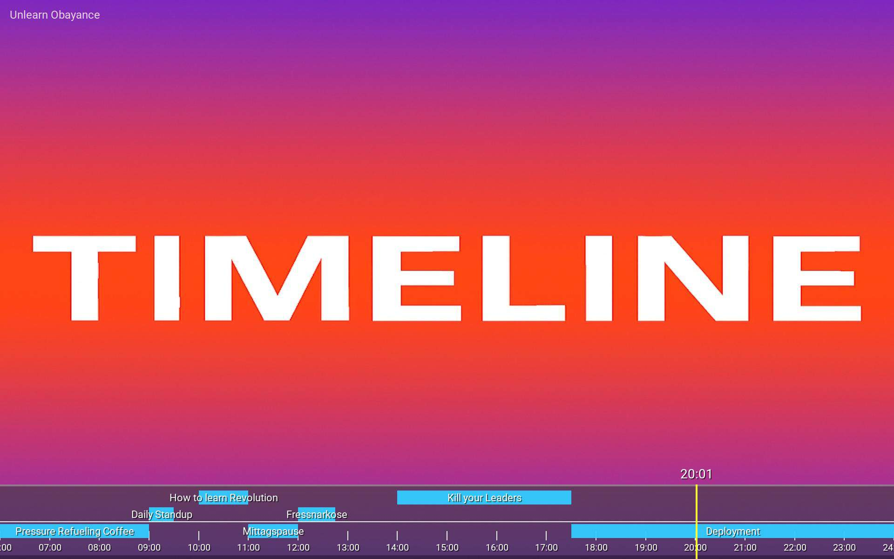

# info-beamer-timeline
A modern horizontal day-timeline for info-beamer hosted.



## ⭐ Features
- Daily timeline from 06:00–24:00
- Events from file or inline config (events.json or events_inline)
- Glass-style design with depth, glow and soft shadows
- Animated “Now” indicator that moves in realtime
- Background image or video configurable via Setup
- Minimal dependencies — runs on any info-beamer Pi (4 & 5 tested)

## 📦 Package Structure
- package.json – Package metadata
- node.json – Setup configuration (background, events, options)
- node.lua – Rendering logic
- Roboto-Regular.ttf – Font (must be added manually)
- background.jpg – Default background (must be supplied)
- package.png – Package icon (PNG, <8 kB)

## 📅 Events
Events can be provided in two ways:

### 1. From events.json
```json
{
  "events": [
    { "title": "Standup", "start": "09:00", "end": "09:30" },
    { "title": "Workshop", "start": "10:00", "end": "11:30" }
  ]
}
```

### 2. Inline via Setup (events_inline)
Inline events override the file version.

## 🖼️ Background (Image or Video)
Choose a background in the Setup:
- PNG/JPG images
- MP4/MOV videos (H.264 + AAC recommended)

## ⏱️ Timeline Rendering
- Hours range: 06:00–24:00
- Bars scale to the time window
- Real-time “Now” line movement
- Current event highlighted
- Overlapping events auto-stacked

## 🔧 Setup Options (node.json)
- background: asset
- events_inline: string (JSON)
- timezone_offset: number

## 🛠️ Development
Clone the repository:
```bash
git clone https://github.com/s3rdl/info-beamer-timeline
```

Push updates:
```bash
git push origin main
git push info-beamer main:master
```

## 📜 License
info-beamer-timeline © 2025 Serdal
GPLv3 — See https://www.gnu.org/licenses/

## ❤️ Credits
info-beamer hosted by dividuum  
Design & implementation by Serdal
